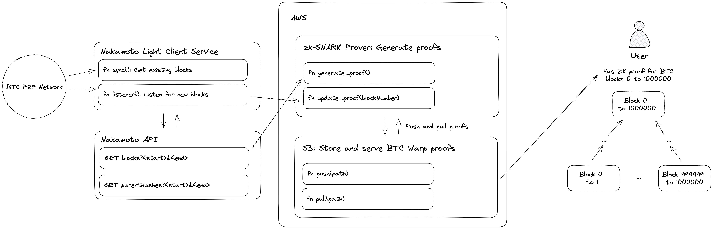

# BTC Warp
## Prove and verify the longest Bitcoin PoW chain

BTC Warp is a proof-of-concept system that aims to solve the client-syncing problem for Bitcoin by using zkSNARKs to prove the validity of the longest valid proof-of-work chain.

A large barrier of entry into self-hosted nodes for Bitcoin and other chains is the cost to store all 
historical state and the time to sync with the network. Syncing can take several days and the hardware 
costs to store and stay in sync with the p2p network can be steep. 

To solve this, one entity can generate a ZK proof of validity for the longest valid Bitcoin chain once
and others can verify the proof to get the last valid BTC block. 

For more details, read our blog post [here](https://blog.succinct.xyz/blog/btc-warp)!

## Running BTC Warp
BTC Warp is made up of several systems that need to run together to generate proofs.


We start with the [Nakamoto](https://github.com/cloudhead/nakamoto) light client that listens to the BTC p2p network for new blocks. Nakamoto is a Rust Bitcoin light client focused on privacy.
When the light client service initiates a full sync or detects a new block, it sends block headers to the zkSNARK
prover to generate proofs and store them. The proofs are then served to the end user.

BTC Warp provides an `btc-warp` library that interfaces between the ZK circuits and infrastructure.
First, compile into a binary executable using `cargo build --release` and add to path to 
`chmod +x target/release/btc-warp`.
To run a service, `cd` into the root of this repo and run the commands listed below.
* Run light client services:  
    ```bash lc-service.sh```
    * This command runs the following two commands together:
    * Light client: `./btc-warp light-client`
        * This runs the light client service that listens to the Bitcoin p2p network. We need the light client service when generating our initial proof and to update our proof for newly generated blocks
    * Light client API: `./btc-warp lc-api`
        * This runs the simple REST API server that serves blocks and parent hashes that the light client service has stored. The light client API is useful for supplying block headers for proof generation and should run alongside the light client service.
* Generate historical proof:  
    ```./btc-warp historical --layer <LAYER> --index <INDEX> --child-proofs-per-layer <CHILD_PROOFS_PER_LAYER>... --num-proofs-per-layer <NUM_PROOFS_PER_LAYER>... --postfix <POSTFIX>```
    * This command should be run in an AWS container to generate a proof of all blocks the light client service has seen so far. Proof generation happens in layers for parallelization, so arguments such as `layer_num`, `index`, and other information are passed in. This command uses the light client API to get block headers and stores the generated proof in a AWS S3 bucket.
* Generate next block proof:  
    ```./btc-warp next-block --block-index <BLOCK_INDEX> --child-proofs-per-layer <CHILD_PROOFS_PER_LAYER>... --postfix <POSTFIX>```
    * This command should be run in an AWS container to generate a proof of the "next" block the light client as seen. The `next-block` command helps the light client catch up to the current longest Bitcoin PoW chain after generating a historical proof using the command above. This command uses the light client API to get block headers and stores the generated proof in a AWS S3 bucket.

## Acknowledgements
We would like to acknowledge Geometry and the team at [ZeroSync](https://geometry.xyz/notebook/A-light-introduction-to-ZeroSync), a project to generate STARK proofs of the Bitcoin blockchain. BTC Warp was developed independently by the Succinct Labs team, starting as a hackathon idea at ETH San Francisco, with the help of Jesse Zhang, Patrick Insinger, and Marc Ziade.